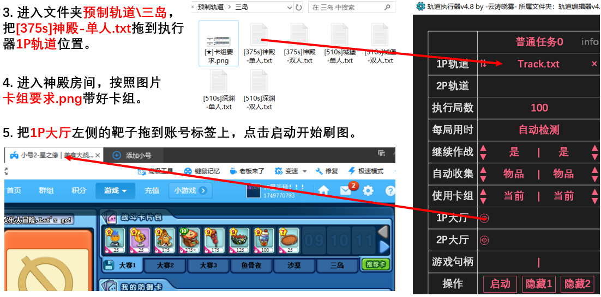

- 轨道只能用于360游戏大厅或微端，其中360游戏大厅具备多开、刷新、加速等重要功能，是登录器的首选。本节介绍如何安装和配置360游戏大厅。 
- 1. 进入360游戏大厅官网：[https://360game.360.cn ](https://360game.360.cn)，点击右上角的“客户端下载”，下载游戏大厅安装包并进行安装，或 [点击下载360游戏大厅（轨道稳定适配此版本）](https://yxdt.game.keniub.com/360game5_setup.exe) 下载 360 游戏大厅。
- 2. 打开游戏大厅，依次点击我的→添加游戏，输入游戏名称和网址。 
**4399** https://my.4399.com/yxmsdzls/wd-air  
**QQ 空间** https://game.qzone.qq.com/13057?via=QZ.MYAPP   
**QQ 游戏大厅** http://qqgame.qq.com/webappframe/?appid=10802  
- 启动游戏后，请在大厅右上角切换到极速模式。

- 3. 启动游戏并登录账号。如果大厅右上角是兼容模式，需要切换为极速模式。

