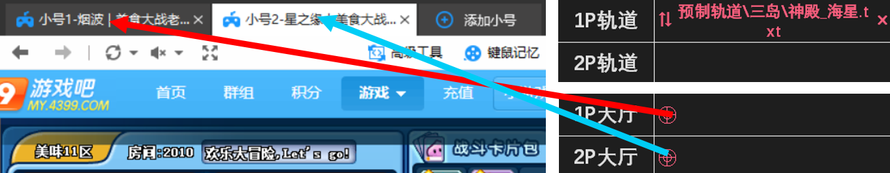
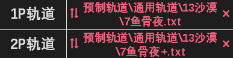

- 打开后能看到两个人物位置的轨道是双人轨道，例如[375s]神殿-双人.txt（左图）。将双人轨道拖入房主轨道 ，同时抓取房主和队友标签（右图），即可由房主带队友刷图。

 

- 也可以同时填写房主和队友轨道（右图），此时房主和队友都按各自的轨道放卡。预制轨道中文件名带+的是队友专属轨道（左图），这类轨道必须和对应的房主轨道一起使用。 

 

- 双人刷图时所有放卡账号必须保持可见。如果两个号都放卡，需点击大厅右上角多窗口玩游戏将两个窗口分别显示。启动后，点击   隐藏 1 和 隐藏 2 可分别隐藏两个窗口。 

- 若同时执行多组刷图，需要将每组刷图中的放卡账号都显示出来。 
