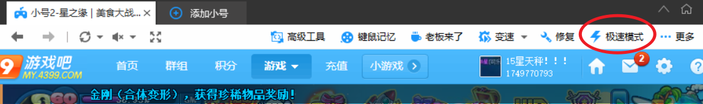

### Q1. 如何安装和更新？
- 答：直接运行安装包，即可将软件安装在当前目录。将安装包放在旧版轨道文件夹内运行，即可更新版本并保留数据。

### Q2. 如何用 360 游戏大厅登录美食？
- 答：去官网 http://360game.360.cn 下载 360 游戏大厅，打开后依次点击我的→添加游戏，输入美食大战老鼠网址。各平台网址如下： 
-- **4399** https://my.4399.com/yxmsdzls/wd-air  
-- **QQ 空间** https://game.qzone.qq.com/13057?via=QZ.MYAPP   
-- **QQ 游戏大厅** http://qqgame.qq.com/webappframe/?appid=10802  
- 启动游戏后，请在大厅右上角切换到极速模式。

### Q3. 360 游戏大厅是流氓软件吗？微端和浏览器能用吗？
- 答：360 游戏大厅不是流氓软件，在设置里取消勾选各项推荐即可安心使用（下图）。微端可以用，但不能双开和自动刷新，不如360 游戏大厅方便。浏览器不能用。

- （可选操作：按 Win+R 打开运行窗口，输入%appdata%并回车，在弹出的文件夹中新建文本文档，重命名为 360se6（删除后缀名）。这样即便点到 360 浏览器广告也不会安装）

### Q4. 轨道编辑器/轨道执行器打不开，提示缺少 dll 文件，怎么办？
- 答：进群下载 dll 修复工具，安装里面的微软常用运行库，然后重启电脑即可。

### Q5. 已进入房间/关卡，仍然提示“未进入房间”或“进入关卡失败”怎么办？
- 答：先尝试刷新游戏，不行则重启电脑，大多数情况下都能解决。