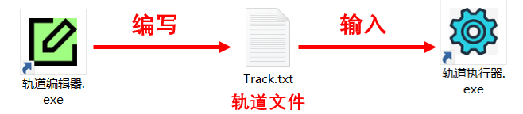

## Welcome!

感谢大家使用轨道编辑器！请仔细阅读轨道使用手册（文件夹自带版或Web版均可），祝您有个愉快的使用体验！

## 新手快速入门
本软件的构造如图所示：轨道编辑器编写轨道文件，然后输入轨道执行器执行刷图。
 
为了让用户尽快上手，本章先介绍如何用现成的轨道文件（预制轨道）刷图，轨道文件的介绍及编写方法则放在第 2 章讲解。使用过程中遇到问题请先看 [1.3 常见问题解答](1.3.md)，若依然无法解决，请将游戏和软件 ==全屏截图== 向群友提问。

## 本章节预览

- [1.1 一分钟开始刷神殿](1.1.md)
- [1.2 双人刷图](1.2.md)
- [1.3 常见问题解答](1.3.md)
