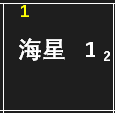

- 阵型编辑界面主要由卡槽、防御卡背包、地图等区域组成。从防御卡背包中携带卡槽，然后将卡槽中的卡片放置到地图中，即可完成布阵。

### 2.1.1 基本操作

<table>
<thead>
  <tr>
    <th>操作名称</th>
    <th>操作方法</th>
    <th>操作名称</th>
    <th>操作方法</th>
  </tr>
</thead>
<tbody>
  <tr>
    <td>选卡</td>
    <td>单击防御卡背包中的卡片</td>
    <td>删除选卡</td>
    <td>右击卡槽中的卡片</td>
  </tr>

  <tr>
    <td>交换卡槽</td>
    <td>单击卡槽 A，右击卡槽 B</td>
    <td>更换卡槽</td>
    <td>单击卡槽，右击背包中的卡片</td>
  </tr>

  <tr>
    <td>放卡</td>
    <td>选中卡槽，单击地图格子</td>
    <td>删除放卡</td>
    <td>右击地图中的卡片</td>
  </tr>

  <tr>
    <td>清空放卡</td>
    <td>选中卡槽后右击卡槽</td>
    <td>移动卡片</td>
    <td>选中卡片，单击目标格子</td>
  </tr>

  <tr>
    <td>切换双人</td>
    <td>单击左上角“+”</td>
    <td>移动人物</td>
    <td>选中人物，单击目标格子</td>
  </tr>

  <tr>
    <td>地图背景</td>
    <td colspan="3">将左侧的靶形光标拖至游戏画面，可截取地图作为背景</td>
  </tr>

  <tr>
    <td>双轨模式</td>
    <td colspan="3">点击[添加 2P 轨道]，或将其他轨道文件拖入编辑器。</td>
  </tr>

  <tr>
    <td>清空轨道</td>
    <td>右击 1P 人物/2P 人物</td>
    <td>删除 2P </td>
    <td>无 2P 轨道时右击 2P 人物</td>
  </tr>

  <tr>
    <td>卡片编辑</td>
    <td colspan="3">右击背包中的卡片或点击【新增卡片】。请勿修改默认卡片的名称。</td>
  </tr>

  <tr>
    <td>添加注释</td>
    <td colspan="3">单击底部的注释区，可添加注释文字，用于说明配置要求或其他信息</td>
  </tr>
</tbody>
</table>

> [!tip]
> 温馨提示：误操作不要慌，点右下角 ==“撤销”== 就能恢复，撤销不限步数。 

### 2.1.2 补阵与索敌

<table>
<tbody>
  <tr>
    <td>补阵：单击卡槽右上角激活。补阵模式下，该卡每次放置时会放在阵型顺序中第一个空缺的位置。该功能可以在卡片漏放或被毁时修复阵型，也能用于移动地图的布阵。一般推荐开启。详见 <a href="/Track-Web/guide/mzdpqza3/">5.3 补阵原理与调控</a> 。</td>
    <td>
    </td>
  </tr>

  <tr>
    <td>索敌：单击卡槽中上位置激活。索敌模式下，该卡前 7 次放置优先放在出怪的行数。只能用于煮蛋等单行输出卡开局，且需要开启 <a href="/Track-Web/guide/932mbqdu/">极限成阵</a><!--2.2--> 才能生效。针对特定老鼠、boss 或物件的索敌请看 <a href="/Track-Web/guide/v62bwilf/">4.4 条件放卡</a></td>
    <td>
    </td>
  </tr>
</tbody>
</table>

### 2.1.3 铲除与堆叠

- 假如你在第 2 秒放了小火，第 20 秒想换成海星，可以进行如下操作：①放置小火与铲子；②选中“小火炉 1”；③点击右侧堆叠区的空位置；④在此格放置海星；⑤布置轨道。 
①  ②  ③  ④   
②  ③ 
⑤ 

- 同一层级堆叠了多张卡片时，地图上只会显示其中一张，并在右下角显示它在堆叠区的位置（如“海星 1~2~”的“~2~”）。点击堆叠区下方的底/顶/空可快速切换到最底层/最高层/空位（切换到空位即可继续往这一格放卡）。选中某个卡槽时，切换对同层级的所有卡生效；未选中任何物件时，切换对全图生效。

### 2.1.4 刷技能轨道

- 制作刷技能轨道只需两步：1. 勾选右上角的。2. 不携带卡组，按住 Ctrl 在地图上单击以放置卡片（单击两次放置大火炉类升级卡）。无需进行轨道编辑等操作。

- 刷技能轨道需用 [高级任务](/Track-Web/guide/f0kz7lyd/)<!--3.2--> 的单塔或密室执行。执行时会进入指定层数放卡一遍后立即退出，实现快速刷技能。刷技能的卡片星级至少为 1，否则会损失熟练度（游戏特性）。执行器“操作速度”为“快”时一局仅1~2 秒，如需长时间刷请把局数调到 9999 或刷满所需局数。
