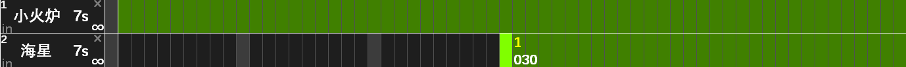

### 2.2 轨道编辑

- 轨道编辑界面主要由时间轴、轨道区组成。“轨道”在图中以蓝色长条表示，例如小火炉轨道  表示在第 2 秒放下第 1 个小火炉。

### 2.2.1 基本操作

| 操作名称 | 操作方法 |
| ---- | ---- |
| 添加轨道 | 点击轨道区空白处。点击已有轨道可按该卡冷却时间连续添加轨道。 |
| 删除轨道 | 右击已添加的轨道。右击防御卡名称可清空该卡轨道。 |
| 填满轨道 | 点击防御卡轨道第 0 秒，会按该卡冷却时间填满整条轨道。 |
| 平移轨道 | 选中防御卡，点击左上角的左右箭头。 |
| 调整冷却 | 选中防御卡，点击左上角的上下箭头。 |
| 翻页 | 点击左上角的左右箭头，或直接点击翻页框数字。一页为一分钟。 |
| 滚动 | 当卡槽数大于 13 时，点击左上角的上下箭头进行滚动显示。 |

### 2.2.2 极限成阵

- 点击防御卡右下角标上“∞”激活极限成阵，轨道以绿色填充：

::: center
（海星设置了从第 30 秒开始放）
:::

- 极限成阵是无条件的自动轨道，只要卡槽亮起就立即放置，以最快速度完成阵型。如果再激活补阵模式则软件会不断修补被毁的卡片。大多数关卡只需激活每张卡的补阵+极限成阵（简称极补），即可完成轨道制作。一些较难关卡不能无脑极补，而是要根据火苗、出怪、场上物件等信息来决定放卡时机和放卡位置，可使用 [4.4 条件放卡](/Track-Web/guide/v62bwilf/) 。

### 2.2.3 录制轨道

- 录制轨道可以将手动放卡转化为轨道文件，方便新用户上手。进入房间后选好卡组，在编辑器中携带同样的卡组，然后点击  按钮，按提示将鼠标放在游戏区域内，软件将自动点击开始并开始录制。玩家每一次放卡都会记录在左侧窗口中，格式为：
::: center
序号 [卡片名] 放卡时间|行列
:::

> [!warning]
> 1. 铲子也必须用鼠标点击才能录上。
> 2. 只要点击了卡槽、地图位置就会记录，而不论是否放置成功，因此应尽量避免多余的点击。如果拿起卡槽失败而程序记录了拿卡，可点击地图左侧释放。如果卡片放置失败而程序记录了放卡，可点击记录右侧的“×”进行删除。
> 3. 注意火苗充足时再放卡，以免实际执行时因为没有及时收集火苗导致放卡失败。录制移动地图轨道时，尽量在卡片阴影与格子重合时放置（如下图），以免录制错位。
> 4. 放卡完成后点击“结束录制”，录制结果自动保存到 Track.txt 中，可以直接执行。

### 2.2.4 定时退出

- 单击界面右侧的，输入退出时间，即可在游戏开始指定时间后退出关卡。主要用途：跨服挂机 60 秒退出刷威望；做单人探险任务时先双人打，胜利前退出一个号，让另一个号完成单人任务。只有魔塔和高级任务能使用定时退出。
