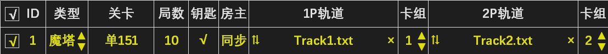
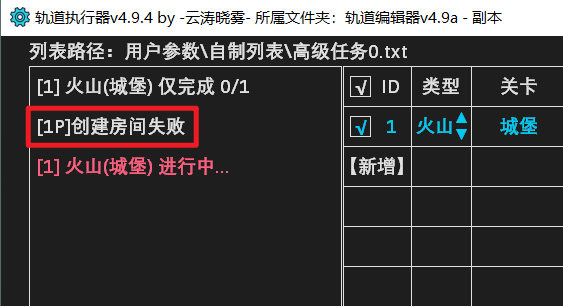
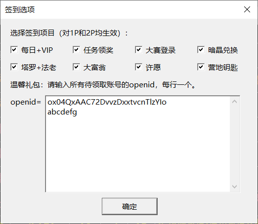
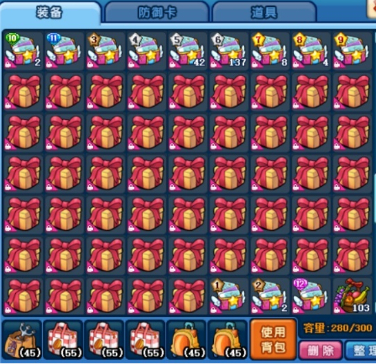
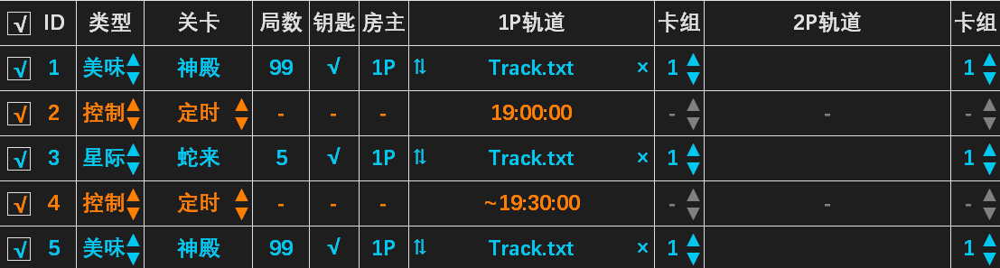

### 3.2 高级任务
- 高级任务可一键完成多项任务（如签到+悬赏+公会任务），界面如下图所示。本节主要介绍战斗任务和事件任务，强化任务的用法请看[3.3 卡片强化系统](3.3.md)。

### 3.2.1 任务列表
- 任务列表用于设置需要执行的各项任务。任务可以自由添加或删除，基本操作如下表：

<table>
<thead>
  <tr>
    <th>操作名称</th>
    <th>操作方法</th>
    <th>操作名称</th>
    <th>操作方法</th>
  </tr>
</thead>
<tbody>
  <tr>
    <td>激活任务</td>
    <td>单击勾选框（打上√）</td>
    <td>选中任务</td>
    <td>单击任务编号（文字变红）</td>
  </tr>

  <tr>
    <td>新增任务</td>
    <td>单击[新增]</td>
    <td>删除任务</td>
    <td>右击任务编号</td>
  </tr>

  <tr>
    <td>交换任务</td>
    <td>依次单击两任务编号</td>
    <td>插入任务</td>
    <td>选中任务，右击插入位置</td>
  </tr>

  <tr>
    <td>复制任务</td>
    <td>选中任务，单击[复制]</td>
    <td>原地复制</td>
    <td>按住 Ctrl 单击任务编号</td>
  </tr>

  <tr>
    <td>定位复制</td>
    <td colspan="3">选中任务，再按住 Ctrl 单击要复制到的位置</td>
  </tr>

  <tr>
    <td>载入列表</td>
    <td colspan="3">将列表文件拖动到高级任务界面或执行器图标上</td>
  </tr>

  <tr>
    <td>批量调整</td>
    <td colspan="3">按住 Shift 调整卡组，对卡组相同的所有任务生效</td>
  </tr>

  <tr>
    <td>批量交换</td>
    <td colspan="3">选中任务 A，按住 Shift 单击任务 B 的卡组，可批量交换两种卡组</td>
  </tr>
</tbody>
</table>

- 设置好每项任务的类型、关卡、局数、轨道、卡组，然后抓取1P和2P大厅，在任意岛屿启动任务，程序便会依次执行任务列表中每项勾选的任务。
- 1. 支持的任务类型有：悬赏、勇士、跨服、魔塔（含宠塔）、副本（假期/公会/巅峰）、任务（公会/情侣/大赛）、主线（三岛/遗迹/海底/星际）、番外（营地/沙漠/雷城/雪山/奇境）、事件（签到/施肥/清包/送花/双倍卡等）、强化（卡片/宝石）。

- 2. 房主可选择1P或2P。例如假期互票65局可以如下设置：

- 3. 将房主设为同步，可以让 1P 和 2P 分别建房执行单人刷图。若一方先刷完，则会等待另一方刷完再执行后面的任务。

- 4. 卡组设为“×”表示该账号不参与本条任务。例如下图表示2P单刷美味悬赏。

- 5. 执行器右侧的  按钮可以为所有任务填写通用轨道。通用轨道所需卡槽截图均已内置，可直接使用空卡组全自动带卡。自动带卡原理请看[5.3 自动带卡](../Ch5/5.3.md)。

- 6. 高级任务可以同时执行 5 组，点击两侧箭头即可切换。点击任务名称可以修改。

:::center

:::

- 如果还不够用，将整个轨道文件夹复制一份，即可同时启动不同文件夹中的执行器。

### 3.2.2 邀请机制

- 执行双人任务时，轨道会通过邀请加入队友。邀请原理如下：
1. 初次执行双人任务时，轨道在好友列表中搜索玩家的角色名，并截图（左图）。
2. 需要邀请该玩家时，轨道在邀请列表中识别队友的角色名，并发送邀请（右图）。

:::warning
一些游戏bug可能导致邀请失败，包括但不限于： 
1. 好友列表无法输入角色名。
2. 好友列表搜索不到角色名。
3. 邀请列表与好友列表角色名显示不一致（如下图）。
:::

- 遇到这些问题时，只需手动截取角色名即可正常邀请。方法如下：
1. 打开用户参数\综合截图工具.exe，进入“角色名”标签：

:::center

:::

2. 将“粗角色名”左侧的图标拖动至头像框位置，软件自动截取粗角色名：

:::center

:::

3. 将“细角色名”左侧的图标拖动至邀请界面对应位置，软件自动截取细角色名：

:::center

:::

- 这样就建立了一份粗细角色名的对应关系（如下图）。重启执行器后，轨道将按照用户截取的细角色名进行邀请。

:::center

:::

4. 含有英文或特殊符号的粗角色名存在两种形态，需要分别与细角色名配对。刷新、换区或单击左上角的角色名即可在两种形态间切换。

5. 如果列表中存在错误的角色名，用户可以右击删除，或者拖动图标截取正确的角色名来覆盖。

### 3.2.3 刷新机制

- 高级任务流程通常较长，为了避免因为游戏的不稳定性导致任务中断（包括但不限于：游戏画面错位、账号掉线、跳转时卡住、邀请时找不到人），轨道将在出现异常时刷新游戏并继续执行任务。触发刷新时会在左上角消息区显示一条报错信息（左图），并在执行记录文件夹中保存此刻的游戏截图（右图），用于检查刷新原因。

- 刷新是轨道应对异常的正常操作，并非轨道bug。大部分问题刷新后即可解决，如果反复刷新，请结合执行记录排查原因，也可查阅[3.2.4 常见报错分析](#_3-2-4-常见报错分析)。

:::warning
注意事项：
1. 需要在执行器右侧设置刷新次数才能启用自动刷新。若一条任务刷新满设定次数仍无法完成，则跳过该条任务。一般设置3-5次即可，因为多次刷新后仍然无法解决的问题大概率一直刷新也无法解决（如魔塔次数不足）。

2. 游戏大厅不能折叠刷新按钮，否则无法刷新。微端不支持刷新。

3. QQ空间/3366刷新时可能需要重登QQ，故必须保持QQ登录才能正常刷新。使用前请用用户参数\综合截图工具.exe截取QQ头像。3366玩家请在执行器上方选择服务器。
:::

### 3.2.4 常见报错分析

| <b>报错信息</b> | 原因分析 |
| ---- | ---- |
| 未找到游戏窗口 | 登录器版本不对。轨道只能用于特定版本的360游戏大厅（群文件有安装包）和官方微端。 |
| 未进入[xx]界面 | 轨道每一步操作后都会识图检查，如果没有进入预期界面则触发此报错。例如点击悬赏图标后10秒内没有打开悬赏面板，就会报错“未进入[悬赏]界面”。网络卡顿、点击失效或游戏bug都可能导致此类问题，也可能是因为游戏机制（关卡未解锁、次数不足）导致无法进入特定界面。 |
| 创建房间失败 | 一般是因为输入密码失败。可能原因有： 1. 用户使用键盘干扰轨道输入，例如按住Ctrl键就会使轨道无法输入密码（并不是说用户不能在轨道运行时使用键盘，毕竟碰到这个问题也能自动刷新解决）。 2. 游戏卡顿导致输入被吞。 |
| 未找到绑定[xx]（带卡失败） | 1. 卡组顺序与轨道不一致。 2. 自定卡槽文件夹没有这张卡的截图。 3. 背包里没有这张卡（有时需要的是占位卡，例如夜晚咖啡粉用木塞子占位，非海底关卡气泡用面粉袋占位）。 4. 卡片未绑定。 |
| 邀请列表中未找到队友名字（邀请失败） | 1. 游戏bug。队友明明和房主在一个区，但邀请列表中就是没有。一般刷新后即可解决。 2. 邀请界面的队友名称和轨道在好友列表搜索到的名称不一致。请使用[3.2.2 邀请机制](#_3-2-2-邀请机制)介绍的方法解决。 |

### 3.2.5 签到施肥（含温馨礼包）

- 添加高级任务“特殊-签到”或“特殊-施肥”，房主、局数、轨道不用填写：

- 卡组“√”“×”表示该账号是否执行。“施肥”包含浇水和施肥。签到包含8项签到和温馨礼包，点击1P轨道即可设置（左图）。其中暗晶兑换需要二级密码（如果有），请点击执行器顶部“无二级密码”进行填写。领取温馨礼包需要填写openid：进入微信服务号“美食大战老鼠”，打开“美食中心”（右图），点击右上角“...”，选择“复制链接”，将链接中“openid=”后面的字母填入温馨礼包输入框即可（左图）。

- openid支持自定义。例如玩家想绑定“1234579”这个openid，只需用浏览器打开网址http://meishi.wechat.123u.com/meishi/index?openid=1234579，然后按提示绑定账号即可。

### 3.2.6 送花

- 添加高级任务“特殊-送花”，即可让两号互相送花。删该功能需要二级密码。

### 3.2.7 清理背包

- 添加高级任务“特殊-清包”，即可自动清理背包空间（依次执行删除道具、分解0星宝石、使用消耗品）。该功能需要二级密码。

- 在用户参数\清理背包文件夹内有截图的物品才会删除、分解或使用。运行用户参数\综合截图工具.exe，选择清理背包选项卡（如左下图），将右上角靶子拖动至道具背包截图需删除的物品，拖动至装备背包截图需分解的宝石和需使用的消耗品（金币、威望等）。

> [!warning]
> 使用消耗品的注意事项：
> 1. 截图了一种物品就会使用所有图像相同的物品，如有不希望使用的物品请放入储藏室。特例：截图普通礼包时，只会使用整理后位于3-11星卡包后面的礼包（如右上图），主要包括十三香礼包、米苏的回礼和星座卡初级技能书箱，不会使用各种转职套餐。但用户至少要保留一个3-11星卡包用于定位，否则不会使用任何普通礼包。
> 2. 只能截图可以无条件使用的物品。如果想使用各类礼包，必须确保背包空间充足，否则使用时会弹出绿字，轨道将判定为无法使用并终止清包流程。不允许使用经验瓶。

### 3.2.8 购买魔塔次数
- 添加高级任务“特殊-买魔塔”，即可自动购买魔塔次数。该功能同样需要二级密码。

### 3.2.9 使用双倍卡
- 添加高级任务“特殊-双倍卡”，“局数”填使用张数，即可自动使用双倍卡。 单击1P轨道可设置只在星期几使用双倍卡（默认为周一至周五），以及使用的双倍卡种类。

### 3.2.10 公会与情侣任务

- 添加高级任务“任务-公会”，局数、轨道不用填写（情侣任务用法相同，不再赘述）：

- 启动后将自动识别当天的公会任务并填写预制轨道，执行完每项任务自动领取奖励。

- 如需修改公会任务预制方案，请将预制列表\公会任务.txt拖入高级任务界面进行编辑：

1. 预制列表中卡组以“+n”表示。若“任务-公会”选择卡组1，则预制列表中“+0”的任务使用卡组1，“+1”的任务使用卡组2（即两数相加），方便不同任务使用不同卡组。
2. 只有勾选的任务才会执行。例如你的配置不足以通关音乐节夜，则可取消勾选此任务。其中4个任务（冰跨12，冰跨13，多拿滋，10损巴旦夜）暂无平民轨道，默认不勾选，若玩家配置足够，可自制轨道后勾选。
> [!warning]
> 预制列表是全部公会任务的方案，请勿直接执行此列表。

### 3.2.11 美食大赛

- 添加高级任务“任务-大赛”。若只需1P完成任务，请将房主设为1P；如需1P和2P均完成任务，请将房主设为同步。

- 启动后将自动识别当前大赛进度，从预制列表中调用对应的轨道并执行。每完成一步后领取奖励并重新识别大赛进度，直至完成全部任务。
- 识别法的优势有：1. 已完成的任务不会重复执行。2. 若执行一步后未完成对应任务，将重复执行本步，防止卡住后续任务（但最多重复3次）。
- 如需修改美食大赛预制方案，请在预制列表文件夹中找到本期大赛的预制列表，使用与 [3.2.10 公会与情侣任务](#_3-2-10-公会与情侣任务) 相同的方法进行编辑。

- 部分操作系统（如 win7）可能因为大赛字体不同导致无法识别，这时可以使用列表法完成大赛，详见 [3.2.12 营地与主线任务](#_3-2-12-营地与主线任务) 。

### 3.2.12 营地与主线任务
- 执行文件名包含“美食大赛”的自制列表时，完成每项任务后自动领取大赛奖励。该方法也能用于全自动完成大赛，但只能按顺序执行各项任务，不能像[3.2.11 美食大赛](#_3-2-11-美食大赛)介绍的识别法一样跳过已完成任务和重试未完成的任务。

- 同理，执行文件名包含“营地任务”的自制列表时，完成每项任务后自动领取营地任务奖励。执行文件名包含“主线任务”的自制列表时，完成每项任务后自动领取主线任务奖励。

### 3.2.13 高级控制（定时、关机、循环执行）

- 假设现在是晚上8点，你希望0点后再启动任务，可以在列表开头添加一项定时任务（如下图）。通常还会跟一条刷新任务来刷新游戏（以便刷新公会任务和掉落次数）。

- 定时可以放在列表的中间或末尾，按效果分为两类：一是强制定时（下图第2条任务），时间到达后若之前的任务还未完成将被放弃。二是非强制定时（下图第4条任务，在时间前面加“~”表示），时间到达后若之前的任务还未完成将继续执行。

- 对于上述列表，19点会强制开始执行第3条“蛇来”，不论第1条“神殿”有没有执行完毕。而到了19点30分，如果第3条还未执行完毕，则会等待执行完毕后再执行第5条。

- 退服指退出游戏，回到选服界面，一般放在列表末尾。任务完成后退服可以大幅降低CPU和内存占用。关机指关闭计算机，需要谨慎使用。

- 循环只能添加在列表末尾，执行到此处后从头开始执行。例如下面的列表表示从0点开始刷花园，刷到8点结束并退服，然后等待第2天0点继续循环。

