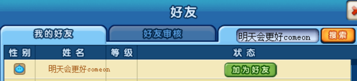
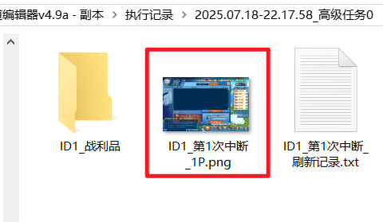
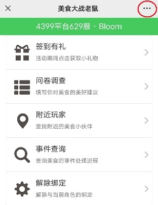
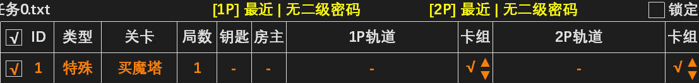

### 3.2 高级任务
- 高级任务可一键完成签到、悬赏、公会、大赛等任务，界面如下图所示。

### 3.2.1 基本用法
- 1. 设置好每项任务的轨道和卡组，然后抓取 1P 和 2P 的标签，在任意岛屿启动任务。程序将依次执行每项勾选的任务。支持的任务类型有：悬赏、勇士、跨服、魔塔（含宠塔）、副本（假期/公会/巅峰对决）、任务（公会/情侣/大赛）、主线（美味至星际）、番外（营地/沙漠/雷城/雪山/奇境）、特殊（签到/施肥/清包/双倍卡）。任务列表基本操作如下表：

<table>
<thead>
  <tr>
    <th>操作名称</th>
    <th>操作方法</th>
    <th>操作名称</th>
    <th>操作方法</th>
  </tr>
</thead>
<tbody>
  <tr>
    <td>激活任务</td>
    <td>单击勾选框（打上√）</td>
    <td>选中任务</td>
    <td>单击任务编号（文字变红）</td>
  </tr>

  <tr>
    <td>新增任务</td>
    <td>单击[新增]</td>
    <td>删除任务</td>
    <td>右击任务编号</td>
  </tr>

  <tr>
    <td>交换任务</td>
    <td>依次单击两任务编号</td>
    <td>插入任务</td>
    <td>选中任务，右击插入位置</td>
  </tr>

  <tr>
    <td>复制任务</td>
    <td>选中任务，单击[复制]</td>
    <td>原地复制</td>
    <td>按住 Ctrl 单击任务编号</td>
  </tr>

  <tr>
    <td>定位复制</td>
    <td colspan="3">选中任务，再按住 Ctrl 单击要复制到的位置</td>
  </tr>

  <tr>
    <td>载入列表</td>
    <td colspan="3">将列表文件拖动到高级任务界面或执行器图标上</td>
  </tr>

  <tr>
    <td>批量调整</td>
    <td colspan="3">按住 Shift 调整卡组，对卡组相同的所有任务生效</td>
  </tr>

  <tr>
    <td>批量交换</td>
    <td colspan="3">选中任务 A，按住 Shift 单击任务 B 的卡组，可批量交换两种卡组</td>
  </tr>
</tbody>
</table>

- 2. 1P 和 2P 均可做房主。例如假期互票 65 局可以如下设置：

- 3. 双人轨道可以用于单人刷图，只需将被禁用的账号卡组设为“×”即可：

- 4. 将房主设为同步，可以让 1P 和 2P 分别建房执行单人刷图。若一方先刷完，则会等待另一方刷完再执行后面的任务。

- 5. 执行器右侧的  选项用于控制建房和刷技能的速度。如果您的电脑和网络能流畅运行游戏，建议设置为“快”以提高执行效率。

- 6. 执行器右侧的  按钮可以为所有任务填写通用轨道。通用轨道所需卡槽截图均已内置，可直接使用空卡组全自动带卡。

- 7. 执行器右侧的  按钮可以检查完成整个列表需要的钥匙、徽章和防御卡（不包含公会、情侣、大赛这三类需要识别的任务）。

- 8. 高级任务可以同时执行 5 组，点击两侧箭头即可切换。点击任务名称可以修改。

:::center

:::

- 如果还不够用，将整个轨道文件夹复制一份，即可同时启动不同文件夹中的执行器。

### 3.2.2 签到施肥（含温馨礼包）

- 添加高级任务“特殊-签到”或“特殊-施肥”，房主、局数、轨道不用填写：

- 卡组“√”“×”表示该账号是否执行。签到包含每日签到、VIP签到、日常任务领奖和领取温馨礼包，“施肥”包含浇水和施肥。

- 领取温馨礼包前需要点击“点此设置温馨礼包”填写openid。进入公众号“美食大战老鼠”，打开“美食中心”（左图），点击右上角“...”，选择“复制链接”，将链接中“openid=”后面的字母填入温馨礼包设置面板（右图）。最多可以填写10个openid。

- openid支持自定义。例如玩家想绑定“1234579”这个openid，只需用浏览器打开网址http://meishi.wechat.123u.com/meishi/index?openid=1234579，然后按提示绑定账号即可。

### 3.2.3 二级功能（清理背包、买魔塔次数）

- 添加高级任务“特殊-清包”，即可自动清理背包空间（包括删除道具和分解0星宝石），以免各项任务无法领取奖励。如果账号有二级密码，请点击顶部“无二级密码”进行填写。

- 在用户参数\可删物品文件夹内有截图的物品才会删除、分解。软件内置了 9 种可分解宝石的截图（如下图），其他需要删除的物品请用用户参数\综合截图工具.exe 自行截图。

- 安全起见，请把贵重物品（如进化凭证）存入储藏室以防误删。

- 添加高级任务“特殊-买魔塔”，即可自动购买魔塔次数。该功能同样需要二级密码。

### 3.2.4 使用双倍卡
- 添加高级任务“特殊-双经卡”（或双爆卡），“局数”填张数，即可自动使用双倍卡。

### 3.2.5 公会与情侣任务

- 添加高级任务“任务-公会”，局数、轨道不用填写（情侣任务用法相同，不再赘述）：

- 启动后将自动识别当天的公会任务并填写预制轨道，执行完每项任务自动领取奖励。

- 如需修改公会任务预制方案，请将预制列表\公会任务.txt拖入高级任务界面进行编辑：

1. 预制列表中卡组以“+n”表示。若“任务-公会”选择卡组1，则预制列表中“+0”的任务使用卡组1，“+1”的任务使用卡组2（即两数相加），方便不同任务使用不同卡组。
2. 只有勾选的任务才会执行。例如你的配置不足以通关音乐节夜，则可取消勾选此任务。其中4个任务（冰跨12，冰跨13，多拿滋，10损巴旦夜）暂无平民轨道，默认不勾选，若玩家配置足够，可自制轨道后勾选。
> [!warning]
> 预制列表是全部公会任务的方案，请勿直接执行此列表。

### 3.2.6 美食大赛

- 此处只介绍识别法，列表法完成大赛请见 [3.2.7 营地与主线任务](#_3-2-7-营地与主线任务) 。
- 添加高级任务“任务-大赛”。若只需1P完成任务，请将房主设为1P；如需1P和2P均完成任务，请将房主设为同步。

- 启动后将自动识别当前大赛进度，从预制列表中调用对应的轨道并执行。每完成一步后领取奖励并重新识别大赛进度，直至完成全部任务。
- 识别法的优势有：1. 已完成的任务不会重复执行。2. 若执行一步后未完成对应任务，将重复执行本步，防止卡住后续任务（但最多重复3次）。
- 如需修改美食大赛预制方案，请在预制列表文件夹中找到本期大赛的预制列表，使用与 [3.2.5 公会与情侣任务](#_3-2-5-公会与情侣任务) 相同的方法进行编辑。

### 3.2.7 营地与主线任务
- 执行文件名包含“美食大赛”的自制列表时，完成每项任务后自动领取大赛奖励。该方法也能用于全自动完成大赛，但只能按顺序执行各项任务，不能像 3.2.5 介绍的识别法一样跳过已完成任务和重试未完成的任务。

- 同理，执行文件名包含“营地任务”的自制列表时，完成每项任务后自动领取营地任务奖励。执行文件名包含“主线任务”的自制列表时，完成每项任务后自动领取主线任务奖励。

### 3.2.8 自动刷新

- 1. 启用自动刷新时，遇到进房失败、账号掉线等问题会刷新后继续执行。
- 2. 自动刷新可设置次数限制（如下图）。若单项任务刷新满次数仍无法完成，则跳过该条任务。若执行的是美食大赛列表，一条任务无法完成将终止列表。
::: center

:::
- 3. 游戏大厅不要折叠刷新按钮，否则无法刷新。微端不支持刷新。

- 4. QQ 空间/3366 刷新时可能需要重登 QQ，故必须保持 QQ 登录才能正常刷新。使用前请用用户参数\综合截图工具.exe 截取 QQ 头像。3366 玩家请在执行器上方选择服务器。

### 3.2.9 高级控制（定时、关机、循环执行）

- 假设现在是晚上8点，你希望0点后再启动任务，可以在列表开头添加一项定时任务（如下图）。通常还会跟一条刷新任务来刷新游戏（以便刷新公会任务和掉落次数）。

- 定时可以放在列表的中间或末尾，按效果分为两类：一是强制定时（下图第2条任务），时间到达后若之前的任务还未完成将被放弃。二是非强制定时（下图第4条任务，在时间前面加“~”表示），时间到达后若之前的任务还未完成将继续执行。

- 对于上述列表，19点会强制开始执行第3条“蛇来”，不论第1条“神殿”有没有执行完毕。而到了19点30分，如果第3条还未执行完毕，则会等待执行完毕后再执行第5条。

- 退服指退出游戏，回到选服界面，一般放在列表末尾。任务完成后退服可以大幅降低CPU和内存占用。关机指关闭计算机，需要谨慎使用。

- 循环只能添加在列表末尾，执行到此处后从头开始执行。例如下面的列表表示从0点开始刷花园，刷到8点结束并退服，然后等待第2天0点继续循环。

