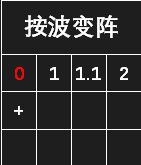
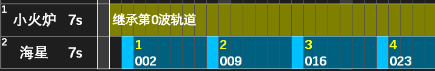

### 4.3 按波变阵

- 按波变阵即进入指定波次后使用新的放卡程序。例如：音乐节夜第 6 波后排放葫芦针对战警，击败后（第 8 波）改为海星蹲守卫；最后一波停止一切放卡，以免完不成万火任务。

### 4.3.1 基本操作

::: info 信息
新建波次：点击“+”，输入要创建的波次。您可以在新波次重新设置每张卡的阵型和轨道，关卡到达该波就会按该波轨道放卡。 
选择波次：点击波次。 
删除波次：右击波次。 
移动波次：按住 Shift 点击目标波次或“+”，可将当前波次移动到目标波次或新波次。 
复制波次：按住 Ctrl 点击目标波次或“+”，可将当前波次复制到目标波次或新波次。推荐用复制方式创建新波次，这样可以保留原阵型，方便铲除原有卡片和放置新卡。
:::

### 4.3.2 执行原理

- 若轨道包含 0,4 两个波次，则执行时先按照第 0 波轨道放卡，进入第 4 波后改为按第 4 波轨道放卡。进入新波次后，原波次未放完的卡不再放置。
- 如果希望某些卡到达新波次后继续执行原波次的轨道，只需单击卡槽左上角的编号启用轨道继承。例如第 4 波轨道按下图设置时，小火进入第 4 波后继续执行第 0 波轨道，而海星则执行第 4 波轨道。

### 4.3.3 波次规则与注意事项

- 1. 波次计算规则：开局为 0.0 波，首次出怪、进度条移动、boss 亮血条均增加 1 小波；大波为进度条上的“第 x 波”，无进度条时（如跨服 boss 段、公会副本）boss 死亡更新 1 大波；大波更新时小波归零。
- 2. 如需使用小波变阵，开局有雾的关卡请立即放油灯，以免检测不到第 1 小波出怪。
- 3. 卡槽的新增、删除、交换和更换会同步到所有波次，其他操作则只影响本波轨道。
