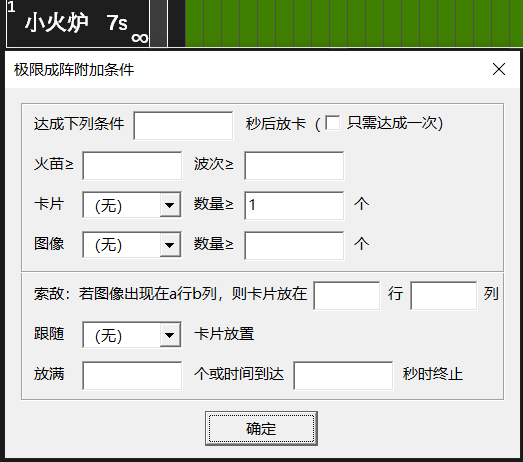
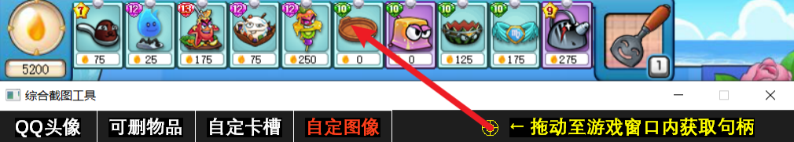
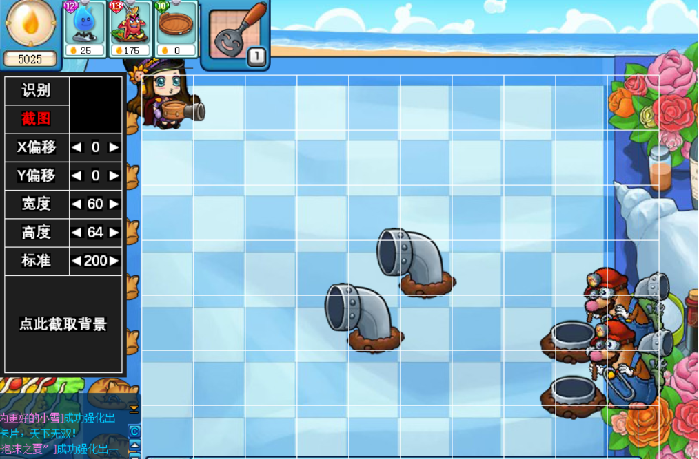
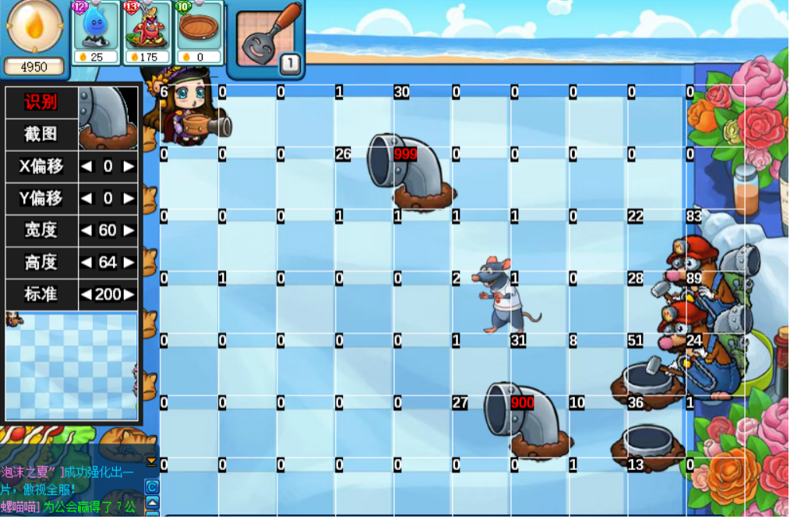

### 4.4 条件放卡

- 一些较难的关卡不能无条件极补，而是需要根据关卡环境作出相应的对策。例如：戈壁开局放不下防风草会被龙卷风摧毁，因此需要为防风草留出最低火苗；音乐节夜容易被大波瓦力破阵，因此需要在特定波次进行轰炸；梦境疯帽匠放出的帽子威胁很大，因此需要用面粉袋精准压掉。条件放卡可以根据火苗、波次、卡片、图像（老鼠、BOSS、物件）等信息执行放卡，大幅提高轨道战斗力。
- 按住 Ctrl 点击防御卡右下角的“∞”，可设置极限成阵轨道的放卡条件，如图所示：

### 4.4.1 火苗、波次、卡片和图像条件

| 条件 | 说明 |
| ---- | ---- |
| 火苗 | 火苗达到设定数值后放卡。 例如冰沙可设置火苗≥1000 才放置，以免用冰后严重缺火。 |
| 波次 | 波次达到设定数值后放卡，可以用 a.b 表示第 a 波第 b 小波。 例如狮子座可设置波次≥1 才放置，在前期没有鼹鼠时节约火苗。 |
| 卡片 | 场上特定卡片数量达到设定数值后放卡。 例如糖葫芦设置卡片【海星】数量≥3，则放满 3 个海星才会放糖葫芦。 |
| 图像 | 场上特定图像数量达到设定数值后放卡。 例如草扇设置图像【神风】数量≥1，则神风出现时才会放草扇。 所用图像需要自行截取（[详见 4.4.3 自定图像的识别与截取](#_4-4-3-自定图像的识别与截取)）。 |

- 设置多项条件时，所有条件同时满足才视为条件达成。

### 4.4.2 延时、索敌、跟随和终止条件

| 条件 | 说明 |
| ---- | ---- |
| 达成 | 勾选只需达成一次，条件达成一次即开始放卡，否则每次放卡都要满足条件。 例如条件为火苗≥1000，若勾选只需达成一次，则火苗满 1000 开始放卡，之后火苗低于 1000 也照放不误。若不勾选，则每次放卡都要求火苗≥1000。 |
| 延时 | 条件达成后等待一定秒数再放卡。 例如可乐条件为图像【神风】数量≥1，达成条件 2 秒后放卡，则每次出现神风后等待 2 秒才放可乐。 |
| 索敌 | 根据图像位置放置卡片（设置了图像条件才能使用，图像位置记为 a 行 b 列）。 例如面粉袋条件为图像【帽子】数量≥1，卡片放在 a 行 b+1 列，则每次出现帽子时将面粉袋放在帽子右边 1 格。 |
| 跟随 | 仅在特定卡片放置成功后放置本卡。 例如幻鸡条件为跟随【海星】放置，则幻鸡紧跟海星放置，避免复制其他卡片。 冰沙、冰激凌也可以设置跟随要冷却的卡放置，确保效用最大化。 |
| 终止 | 放卡数量或时间到达设定值后不再放卡。 |

### 4.4.3 自定图像的识别与截取

- 1. 运行用户参数\综合截图工具.exe，将图标拖至游戏画面，软件将显示实时截图。

- 2. 点击【截图】冻结画面（左图）。点击【点此截取背景】截取地图背景，然后点击格子截取本格图像（例如要识别洞君的管道，点击管道所在格子即可保存管道截图）。

 

- 3. 点击【识别】恢复实时画面（右图）。每个格子左上角显示本格图像与截图的匹配度（默认匹配度 200 以上视为识别成功，以红色显示）。

- 4. 左侧可以调节识别范围的 X 偏移、Y 偏移、宽度、高度以及识别成功的标准。这些参数会自动保存在图像的文件名中，例如管道\[200\](0,0,60,64).bmp（不设参数视为默认）。不同物件可能需要选用不同的识别范围和识别标准，请确认能够识别再用于战斗。

- 5. 将图像文件拖至软件窗口内可设为当前识别的图像。
