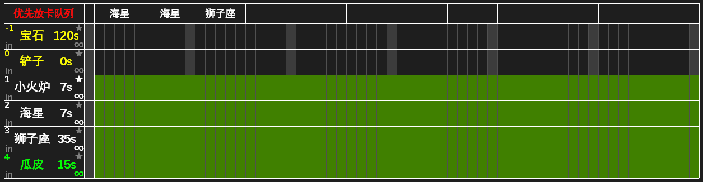

### 4.5 优先放卡队列

- 如果小火炉、海星、狮子座全部开启极限成阵，则火苗一到 175 就会放海星，导致很难攒下放狮子座的火苗。为此我们提供了优先放卡队列，确保依次放下队列中的每张卡片后再放其他卡片。单击左上角“优先放卡队列”，然后依次单击海星、海星、狮子座将它们加入队列，则执行时会先放 2 个海星，然后攒火苗放 1 个狮子座，然后才会放置其他卡片。

- 单击小火炉右上角的★可标记为绝对优先。无论队列中的卡有没有放置完毕，绝对优先
卡都会正常放置。
