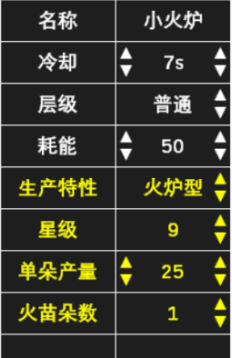
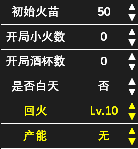
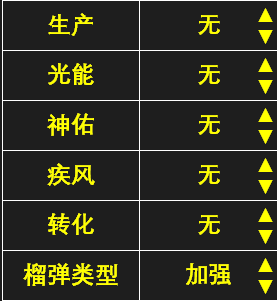

### 4.6 自动布轨

> [!warning]
> 本功能正在优化中，建议先不使用。

- 自动布轨通过计算产火和冷却自动安排每张卡的放置时间，确保每张卡都在火苗充足的条件下准时放置。使用前需要将防御卡数据和生产信息填写准确。

### 4.6.1 防御卡编辑

::: info 右击防御卡背包中的卡片进入编辑界面，如图所示。
名称：单击修改。默认防御卡请勿改名，否则会失去卡片特性。 
层级：有承载、护罩、普通、升级、冷却、特殊6种卡片层级。 
耗能：单击数值切换是否带“+”。 
生产特性：非生产、无秒产（双子暖鸡）、火炉型（次轮秒产）、酒杯型（次轮秒产+成长）、四转太（首轮秒产，包括二转火焰牛）。 
生产卡还需填写星级、单朵产量、火苗朵数（数据站 msdzls.cn）。
:::

- 双轨模式下，1P和2P各有一个防御卡背包，两个账号可以设置不同的防御卡参数。

### 4.6.2 生产信息编辑

 

> [!info]
>单击左下角“生产信息”进入编辑界面，如右图所示。此处填写关卡自带生产和产火宝石，方便软件计算火苗。开局小火/酒杯按整局存在计算，若1P携带了初始火、初始灯卡片，则按照实际放置数量和铲除时间来计算产火，无视填写的数量。

- 双轨模式下，1P和2P各有一份生产信息，但开局小火/酒杯的生产仅由1P决定。

### 4.6.3 布轨操作

- 全局布轨：布置完阵型后点击“自动布轨”，软件自动布置所有卡片轨道。其中冰激凌、冰沙、幻幻鸡会被用来冷却它们的上一个卡槽。
- 单卡布轨：双击某张卡可单独对该卡自动布轨。
- 单步布轨：选中某张卡后点击“自动布轨”，可布置该卡的一步轨道。
- 最速优化：轨道区全空时，选中某张卡后点击“自动布轨”，程序将自动安排生产卡，使得被选中的卡最快放下。在上面的例子中，使用最速优化可以在第21秒就放下海星：

- 双轨模式下，1P和2P的生产卡都会参与规划。
