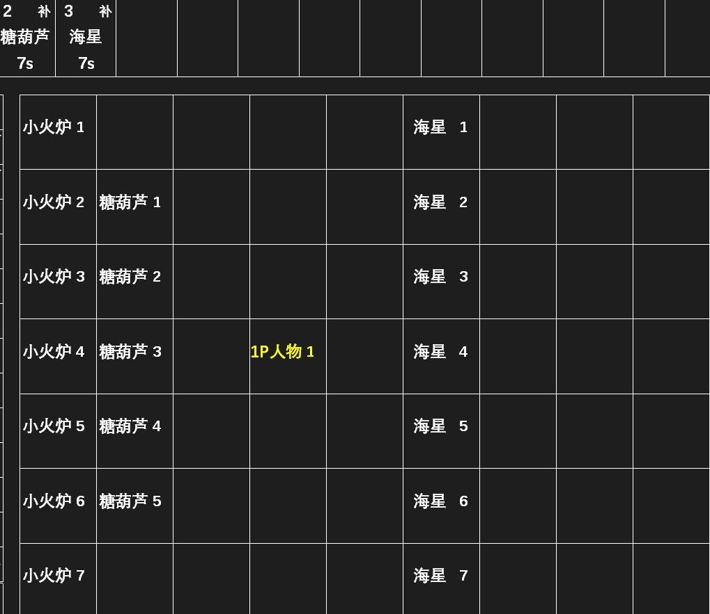
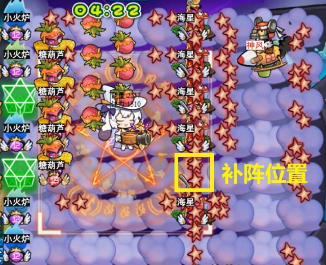
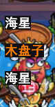

### 5.1 补阵原理与调控

- 最初版本是通过放卡时遍历阵型中的每个位置来实现补阵的。例如在编辑器中把海星放满第6列并开启补阵（左图），则每次放卡时拿起海星依次点击第6列的每一格，使它落在阵型中第一个空缺的位置（右图）。

 

- 为了避免大量遍历导致游戏卡顿，新版软件会对卡片进行识别，只对空缺位置进行补阵。以海星补阵为例，软件会比较地图各格图像与海星模板的相似度。相似度＞40的格子判定为有海星（0%补阵强度下），补阵时会跳过这些格子。

> [!tip]
> 提高补阵强度会降低卡片识别成功率，导致放卡时遍历更多位置。补阵强度为100%时退化为遍历补阵。因此一般情况下补阵强度设为0%最好。但软件有时会把空格误判为有卡（如下图，水上的海星位置偏高，导致上方的空格误判为有海星）。如需避免误判，可以适当提高补阵强度，让判定更严格。

::: center

:::

- 部分卡片识别效果可能不佳，用户可通过自截图进行修复。打开 [4.4.3 自定图像的识别与截取](/Track-Web/guide/v62bwilf/#_4-4-3-自定图像的识别与截取) 介绍的截图识别工具，进入关卡后点击工具下方的“截卡槽”即可截取卡片图像。用户可以调整识别范围和相似标准。将图像放入用户参数\自定卡片文件夹即可完成修复。

- 棉花糖（麦芽糖）补阵使用初始地图遮挡判定法。软件会在开局时截取初始地图，若地图中某个格子中心区域完全被遮盖，则判断该格有棉花糖。每次补阵会放在第一个无棉花糖的位置。开启补阵的棉花糖不能放在开局有卡的格子，因为无法截取这些格子的初始图像。
