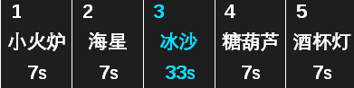

### 5.3 自动带卡

- 为了节约卡组，软件允许用户将某卡槽留空，执行不同轨道时携带不同的防御卡。例如希望以下两个轨道共用一个卡组，则只需将前四张卡保存至卡组，卡槽5留空：

:::center
  

轨道1轨道2保存的卡组
:::

- 然后使用用户参数\综合截图工具.exe 的自定卡槽模块截取酒杯灯和换气扇的图片，并重命名截图使之与编辑器中的卡片名一致：

::: center

:::

- 打开执行器，运行卡槽5为酒杯灯的轨道会自动携带背包里的酒杯灯，运行卡槽5为换气扇的轨道则自动带换气扇。有多张同种卡时，可以在执行器中设置携带最高星或最靠前的卡。

- 同一卡片可以设置多张候选卡。例如酒杯灯可以保存以下2张截图：

::: center

:::

- 执行时优先带酒杯灯_2，找不到酒杯灯_2则带酒杯灯_1。命名格式为卡片名_优先级，其中优先级范围为0~9，数字越大越优先携带。命名不带优先级则视为最低级。

- 通用轨道所需卡片截图均已内置，玩家可以直接使用空卡组全自动带卡。删除全部自定卡槽图片可禁用自动带卡。
