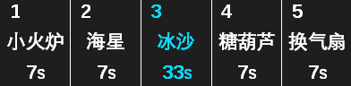
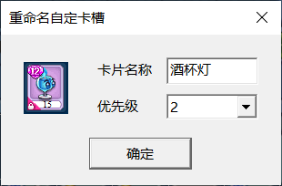

### 5.3 自动带卡

- 使用的卡组中存在空卡槽时，软件将按照轨道中的卡组自动带卡。例如下列卡组第5槽留空，则执行轨道1时自动带换气扇，而执行轨道2时自动带酒杯灯。

:::center
  

保存的卡组轨道1轨道2
:::

- 执行前需用用户参数\综合截图工具.exe的自定卡槽模块截取需携带的卡片，截图命名需与轨道中的卡片名称保持一致。同一卡片名称可以设置多个优先级，范围为-9~9，数字越大越优先携带。例如存在酒杯灯_1和酒杯灯_2两张卡槽截图时（如下图），执行时优先带酒杯灯_2，找不到酒杯灯_2则带酒杯灯_1。

::: center

:::

- 负数优先级表示占位卡。例如将木塞子截图命名为咖啡粉_-1，则夜晚无法携带咖啡粉时用木塞子占位。

- 通用轨道所需卡片截图均已内置，玩家可以直接使用空卡组全自动带卡。删除全部自定卡槽图片可禁用自动带卡。
