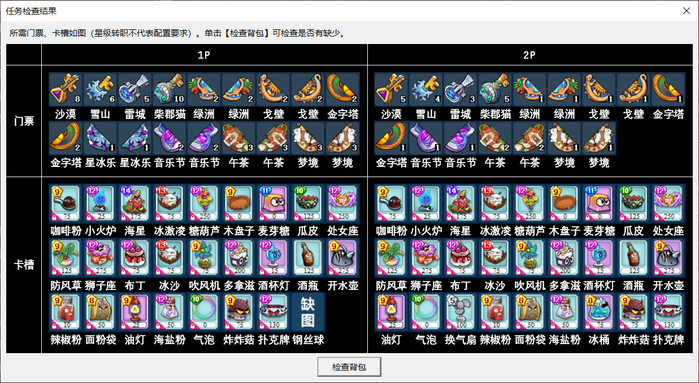
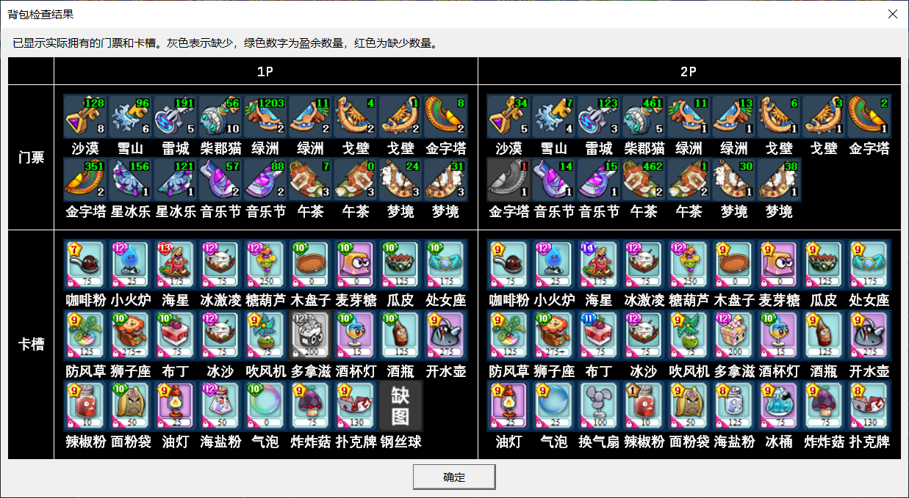

### 5.4 检查任务

- 点击高级任务界面右侧的  ，轨道将自动统计完成整个列表需要的门票和卡槽（如下图，不包含公会、情侣、大赛这三类需要识别的任务）。

:::center

:::

- 显示的卡片截图来自用户参数\自定卡槽文件夹，它们的星级和转职不代表实际需求。单击“检查背包”按钮，轨道将自动翻找背包，统计实际拥有的门票和卡槽（如下图）。缺少的门票和卡槽以灰色显示，门票右上角显示盈余数量（绿）或缺少数量（红）（例如1P需要8把沙漠钥匙，实际拥有136把，则显示绿色的128）。用户可据此补充门票和卡片。

:::center

:::

- 轨道计算门票消耗时都算在房主上面，而实际上房主缺票时队友可以提供门票，所以检查出来缺票不意味着执行时一定缺票。例如列表中只有一条刷10局曲奇岛的任务，检查发现1P缺5把神殿钥匙，这时如果2P有5把神殿钥匙，则执行时不会缺票。当然，两个号的门票都达到数量要求是最稳妥的。
