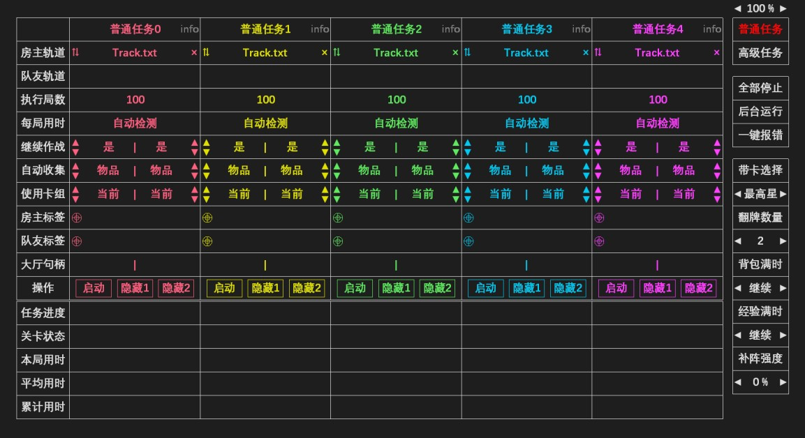
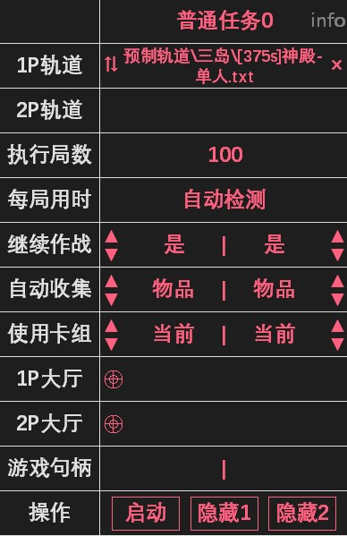
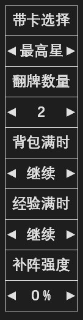
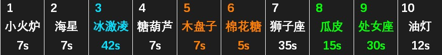
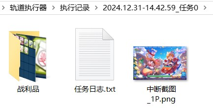
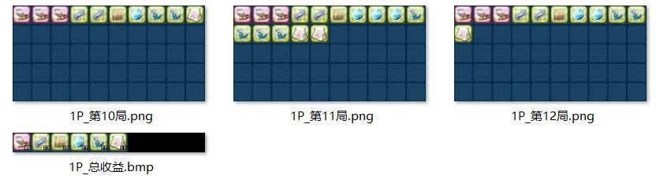

### 3.1 普通任务
- 普通任务界面如下图所示，5 个任务栏位可以同时执行 5 组刷图。如何使用预制轨道刷图已在第 1 章简要介绍，本节将对各项参数的设置和注意事项进行补充。

### 3.1.1 基本用法
- 使用预制轨道或自编轨道刷图时，各设置项说明如下（1P 为房主）：
::: center
 
:::

::: info 说明
 从上到下：
【普通任务0】任务名称可以修改，方便区分不同账号的刷图。
【1p轨道】把轨道文件拖至此处即可自动填写。
【2p轨道】可不填。
【执行局数】刷完 100 局停止。
【每局用时】建议不改。
【继续作战】左右分别为 1P 和 2P 的设置，下同。
【自动收集】有 VIP7 就别开。
【使用卡组】“当前”指当前携带的卡组，也可选择卡组 1-6。
【1p大厅】把图标拖至游戏大厅 1P 窗口内（见 3.1.2）。
【2p大厅】同上，单人刷图不用填。
【游戏句柄】抓取 1P/2P 标签时自动填写。
【操作】点“启动”开始刷图，点“隐藏”隐藏大厅。
:::

### 3.1.2 补充说明

1. 点击可隐藏执行器，再次运行“轨道执行器.exe”恢复界面。
2. 点击可一键打包所需截图和日志，方便上传至交流群提问/报错。执行时遇到问题请上传报错信息，单纯提问（如“为什么不放卡”）很难确定问题的原因。
3. 抓取标签有两种方法。一是抓取标签位置，此方法可以抓取处于后台的账号。
 
二是拖到游戏画面内，此方法只能抓取当前显示的账号。微端操作方法相同。
 

4. 执行器右侧设置说明
::: center
 
:::
- 带卡选择：自动带卡遇到相同卡片（如 2 个开水壶）如何选择，可选择最高星级或背包位置最靠前的卡。
- 翻牌数量：关卡胜利时翻牌的张数。
- 背包满时：建议选择继续，此时遇到“背包空间不足”的提示会继续刷图，遇到没带盘子等提示也会继续。- 若选择停止，遇到这些提示会中断任务。
- 经验满时：每日经验到达上限时会弹窗提示，可选择是否继续刷图。
- 补阵强度：决定补阵的方式。0%只补空位，100%遍历整个阵型。推荐设为 0%（性能最优），若出现漏放卡片，则可以适当调高补阵强度。
> [!tip]
> 以上五项设置对高级任务也有效。

### 3.1.3 卡槽调整

在轨道路径前添加< >指令可以实现卡槽的卸除、替换和放置。
1. 卸除。例如轨道 Track.txt 使用了 10 个卡槽，则<3,4,5>Track.txt 表示卸除 3,4,5 槽（冰激凌、糖葫芦、木盘子）及 10 以后的卡槽，确保只带 7 张卡进入关卡，用于限卡类任务。

 

2. 替换。例如<1 酒杯灯>Track.txt 表示将 1 槽小火炉换成酒杯灯，用于禁小火类任务。
3. 放置。例如<热狗>Track.txt 表示将轨道中第 1 个不使用的卡槽（不含咖啡粉）替换为热狗，并在火苗足够时放置 1 次，用于放卡类任务。
> [!tip]
> 三种指令可以同时使用，如<1 酒杯灯,3,4,5,热狗>Track.txt。

### 3.1.4 开局加速

开局加速一小段时间可以减少出怪间隔，显著提高通关速度。使用加速前需要在游戏大厅中显示加速按钮：依次点击更多-自定义（左图），在自定义设置中只勾选加速（右图），点击确定即可。

   

- 在轨道路径前输入加速时间和分隔符“|”即可开局加速。例如 500|Track.txt 表示开局加速 500 毫秒。如需同时使用加速和卸卡，加速指令放在前面，例如 500|<3,4,5>Track.txt。 
- 开启加速时，胜利结算部分也会被加速跳过。加速时间范围为 0~1000 毫秒。如果填写0|Track.txt，则开局不加速，只加速跳结算。一般关卡推荐将倍速设置为 3 倍，加速时间 500 毫秒。过度加速会导致无奖励。 
- 点击执行器右侧的  可设置全体任务的开局加速时间，优先级低于加速指令。

### 3.1.5 执行记录

- 每次启动任务后会在执行记录目录下生成一个日志文件夹，保存本次任务的战利品、任务日志、中断截图等信息：

- 战利品文件夹保存每局的战利品截图，并统计总收益：

- 任务日志保存启动、终止时间和每局用时。如果执行中断（由掉线或其他错误引发），任务日志中会记录中断原因并保存中断截图。超过 3 天的执行记录将被自动清理。
